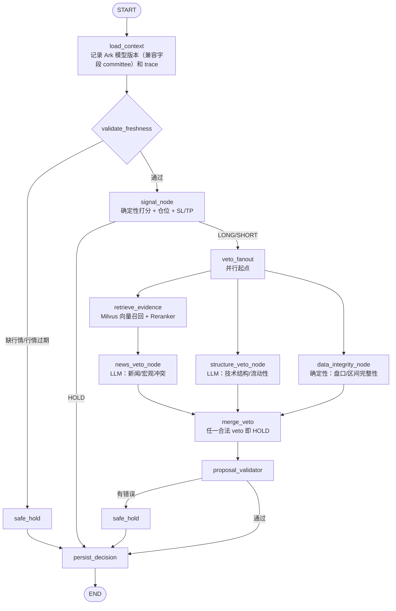

# Alpha Council AI 当前架构与交易生命周期

日期：2026-09-13  
状态：按当前仓库代码整理的 as-built 基线

> 本文是当前实现的事实来源。`docs/superpowers/specs/2026-09-09-alpha-council-ai-design.md`
> 和 `docs/superpowers/specs/2026-09-11-decision-pipeline-redesign-design.md` 主要记录
> 设计动机与演进过程；如果它们与本文冲突，以本文和代码为准。

## 1. 结论摘要

- 当前交易图不是旧设计中的“Market / Quant / Macro 并行分析 → Committee”。编译后的
  `TradingCycleGraph` 实际使用“新鲜度检查 → 确定性规则信号 → 三路 veto 扇出（新闻分支
  使用 RAG）→ 合并/校验 → 持久化”的路径。
- `market_node`、`quant_node`、`macro_node`、`committee_node` 和 `run_committee` 仍在
  `app/agents/graph.py` 中保留，但没有被 `build_trading_cycle_graph()` 注册到当前图，
  因而不是线上决策路径。
- RAG 已接入默认生产图，但只服务于非 HOLD 入场提案的新闻/宏观反向证据。价格、K 线、
  指标、余额、持仓、风控和下单不依赖 RAG。
- 默认止盈是 `2R`，即“止损距离的两倍”，不是入场价格的两倍。交易所侧只保留 `3R`
  灾难止损；正常 `2R` 止盈由本地持仓管理器按软件规则触发 reduce-only 市价平仓。
- 当前持仓管理器还会在达到 `1.8R` 后锁存接近目标时间，超过 6 小时仍未达到 `2R` 就平仓，
  并对所有仓位施加 72 小时绝对持仓上限，避免盈利仓绕过原有 48 小时时间止损后长期占用仓位。

## 2. LangGraph 当前图



对应代码为 `backend/app/agents/graph.py:598-669`。图本身不负责调用 WEEX、下单或对账；
这些动作由 `TradingCycleService` 在图外按顺序执行。

### 2.1 节点职责

| 节点 | 类型 | 当前职责 | 关键输入/输出 |
|---|---|---|---|
| `load_context` | 确定性 | 注入 Ark 模型版本和 trace id；`committee` 是历史兼容字段名 | `model_versions`、`trace_ids` |
| `validate_freshness` | 确定性 | 检查行情是否存在、是否超过新鲜度上限 | 失败写入 `errors` |
| `signal_node` | 确定性规则 | 用 1h/4h 指标计算方向和 composite；按 ATR 反推仓位、止损、止盈、灾难止损 | `TradeProposal`、`signal_score` |
| `veto_fanout` | 确定性 | 将非 HOLD 提案分发给三路校验；避免结构/数据分支等待 RAG | 无新增字段 |
| `retrieve_evidence` | RAG | 新闻分支用固定查询 `"{asset} market outlook"` 检索最多 5 条证据 | `retrieved_evidence` |
| `news_veto_node` | LLM veto | 只判断新闻/宏观是否与规则信号冲突 | `news_macro` verdict |
| `structure_veto_node` | LLM veto | 只判断技术结构失效或盘口流动性异常 | `structure_liquidity` verdict |
| `data_integrity_node` | 确定性 veto | 检查价差、倒挂盘口、24h 区间和现价范围 | `data_integrity` verdict |
| `merge_veto` | 确定性 | 任一路合法 `veto=true` 就生成安全 HOLD | `veto_type` |
| `proposal_validator` | 确定性 | 校验 symbol、入场仓位、止损、证据和有效期 | `errors` |
| `safe_hold` | 确定性 | 生成不可下单的安全 HOLD 提案 | `TradeProposal(action=HOLD)` |
| `persist_decision` | 确定性 | 补充数据版本并结束图 | `data_versions` |

旧分析函数的当前状态：

| 旧函数 | 当前状态 |
|---|---|
| `market_node` / `quant_node` / `macro_node` | 保留实现，但没有加入 builder，不会在当前图执行 |
| `committee_node` / `run_committee` | 保留兼容实现，但当前图不执行；当前方向由 `signal_node` 决定 |
| `AnalysisResult` | 仍作为状态和历史持久化结构的一部分，当前主要承接未执行的兼容字段 |

### 2.2 图流程合理性与后续优化

当前图的主边界是合理的：确定性代码决定方向、仓位和风险参数；LLM 只做封闭枚举的
入场否决；RiskEngine、Execution 和 Reconciliation 保留在图外，分别掌握不可覆盖的
风控、交易所副作用和账户事实。这避免把可审计的资金动作交给模型，也避免让旧的
Committee 再次承担持仓退出职责。

本轮已做一项低风险拓扑优化：`veto_fanout` 提前到 RAG 之前。现在新闻分支是
`retrieve_evidence → news_veto_node`，结构和数据分支从扇出点直接启动，三路最终在
`merge_veto` 汇合。这样 RAG 延迟或暂时不可用不会阻塞确定性数据检查；如果 RAG 失败，
`proposal_validator` 仍会因本轮没有证据而安全 HOLD。

仍建议按优先级继续优化：

1. **P1 安全策略**：LLM 超时、解析失败或 schema 不合法当前记为 `invalid_ignored`，
   也就是不应用该路 veto；交易场景更稳妥的默认值应是 fail-closed，或至少做成显式配置，
   并单独统计降级放行次数。
2. **P1 注入一致性**：`run(..., llm=...)` 的覆盖构图路径没有传入 retriever，真实调用
   时会与默认生产图产生不同语义。应统一通过 graph factory 注入 `llm` 和 retriever，
   测试用 fake retriever，避免“默认路径有 RAG、覆盖路径无 RAG”。
3. **P2 检索质量**：查询应带方向、时间窗和影响期限过滤，至少区分“支持当前方向”和
   “反向风险”两类证据；固定的 `market outlook` 容易召回与本次交易无关的旧新闻。
4. **P2 状态收敛**：删除或隔离旧的 analyst/committee 状态字段，统一模型版本命名，
   并为每个节点记录耗时、输入快照版本、输出 verdict 和降级原因，便于定位是信号弱、
   否决、证据不足还是外部服务异常。
5. **P3 生命周期编排**：图继续只负责“本轮入场决策”；持仓管理、平仓重试和对账仍由
   周期服务负责。若未来需要图化，应拆成独立的 `PositionExitGraph`，避免在同一图中
   混合纯函数决策和不可逆交易副作用。

## 3. 从调度到下单的完整流程

```text
TradingScheduler.run_forever（默认每 300 秒）
  ├─ DocumentPipeline.run_once（RSS/FRED/Federal Reserve → 摘要 → 向量入 Milvus）
  └─ 每个 enabled virtual account × 每个 symbol
       └─ TradingCycleService.run
            1. WEEX 采集 K 线、ticker、盘口/成交/资金费率/OI
            2. 计算技术指标，并把市场数据写入 PostgreSQL
            3. PositionManager 管理已有仓位（在暂停判断和新开仓前）
            4. 读取余额，把 equity 注入 TradingCycleState
            5. 执行 LangGraph
            6. RiskEngine 做不可被模型覆盖的硬风控
            7. ExecutionService 仅对 ALLOWED 提案下单
            8. ReconciliationService 同步订单、仓位、账户余额和 PnL
            9. 写入 trading_decisions / risk_events
```

代码依据：

- 调度与账户/品种循环：`backend/workers/scheduler.py:48-74`
- 采集、持仓管理、图、风控、执行、对账：`backend/app/services/cycle.py:160-357`
- 新仓数量：名义价值为 `balance × position_size_pct`，再除以现价，见
  `backend/app/services/cycle.py:752-781`
- 下单幂等与超时状态：`backend/app/execution/service.py:61-123`

## 4. Agent 与非 Agent 边界

### 4.1 当前实际参与决策的“Agent”

1. **Rule Signal Agent（非 LLM）**：`signal_node` 调用 `score_signal()`。趋势、动量和
   量能产生 `composite`；达到阈值才产生 LONG/SHORT，否则直接 HOLD。
2. **News/Macro Veto Agent（LLM）**：只能基于 `retrieved_evidence` 和 `macro_events`
   判断新闻、宏观 regime 是否反向，不得改方向、仓位或止损。
3. **Structure/Liquidity Veto Agent（LLM）**：只能基于指标和 `microstructure` 判断结构
   失效或盘口流动性异常。
4. **Data Integrity Veto（非 LLM）**：把能通过代码直接证明的异常交给确定性检查，避免
   用 LLM 判断价差倒挂等事实。

LLM 的实际调用统一走 `ArkChatClient.complete_json()`，温度为 0；瞬时 5xx/超时可重试，
解析失败或 schema 不合法时，单个 veto 记为 `invalid_ignored`（当前实现；生产安全策略仍
建议改为 fail-closed）。任一合法 veto 会在
`merge_veto` 变成安全 HOLD。

### 4.2 重要边界

- LLM 没有交易工具，也不能直接调用 WEEX。
- `RiskEngine` 在 LangGraph 之后运行，是最终硬闸门。
- `ExecutionService` 不理解 agent 推理，只接受 `risk_decision.allowed == true`；开仓只发送
  灾难止损，不再发送不可撤销的 `tpTriggerPrice`。
- 平仓主要由 `PositionManager`、手动平仓 API 或 WEEX 触发单完成，不依赖旧的 Committee
  输出 CLOSE。

## 5. RAG 是否已经使用

### 5.1 答案

**已经使用，但不是所有路径都使用。** 默认 `TradingCycleService._default_graph()` 会组装：

```text
BGEEmbedder + MilvusVectorStore + BGEReranker
                ↓
             Retriever
                ↓
       build_trading_cycle_graph(retriever=...)
```

证据链：

- 组装默认 retriever：`backend/app/services/cycle.py:150-158`
- 非 HOLD 才进入检索：`backend/app/agents/graph.py:632-642`
- 查询、资产过滤、向量候选和重排：`backend/app/agents/graph.py:224-235`、
  `backend/app/rag/retriever.py:74-138`
- 文档入库：RSS/Federal Reserve 文本经清洗、去重、Ark 摘要、分块、BGE-M3 embedding
  后写入 Milvus，见 `backend/app/workers/pipeline.py:56-156`、`163-244`

### 5.2 RAG 在哪里生效

| 场景 | 是否使用 RAG | 说明 |
|---|---:|---|
| 规则方向、composite、仓位、SL/TP | 否 | 由指标、现价、ATR、策略参数确定 |
| `news_veto_node` | 是 | 作为新闻/宏观反向证据输入 |
| `structure_veto_node` | 否 | 使用指标和盘口/流动性数据 |
| 价格、K 线、余额、持仓 | 否 | 以 WEEX/数据库事实为准 |
| RiskEngine | 否 | 纯确定性风控 |
| Execution/Reconciliation | 否 | 纯交易所适配与状态同步 |
| HOLD 周期 | 否 | `signal_node` 后直接持久化，节省 RAG/LLM 调用 |

### 5.3 两个容易误判的细节

1. 当前 RAG 查询仍是固定的 `"{asset} market outlook"`，没有按 LONG/SHORT 做反向取证，
   也没有在检索器中实现最近 24 小时的时间过滤。9 月 11 日规格中的“方向反向查询 +
   时间窗”属于未落地的设计建议，不是当前行为。
2. `TradingCycleService.run(..., llm=...)` 的测试/覆盖路径重新构图时没有传入 retriever
   （`cycle.py:280-283`），因此该覆盖路径的 RAG 为空；默认生产构图路径才带有
   Milvus/BGE retriever。若将 `llm` 参数用于真实运行，应补齐同一 retriever 注入。

RAG 失败会返回空证据并追加 `retrieval_failed`；对于 LONG/SHORT，后续
`proposal_validator` 因缺少本次证据而转安全 HOLD。结构化行情与账户事实不写入 RAG。

## 6. 当前止盈、止损和仓位释放

### 6.1 当前参数与计算

`StrategyParams` 默认值：

```text
stop_distance = 1.5 × ATR(1h)
SL             = entry ∓ stop_distance
TP             = entry ± 2.0 × stop_distance   # 2R
灾难止损       = entry ∓ 3.0 × stop_distance   # 3R
```

仓位先按单笔风险预算反推，再受 20% 名义仓位上限约束，见
`backend/app/signals/sizing.py:41-75` 和 `backend/app/signals/params.py:39-49`。

### 6.2 当前实际执行

- `ExecutionService._order_request_for()` 将 `disaster_stop` 用作交易所的 `stop_loss`，并
  将 `take_profit` 置空；`WeexClient.place_order()` 因而只发送 `slTriggerPrice`。
- 本地 `Position` 会保存初始止损、有效止损、止盈和 `near_target_at`，见
  `backend/app/services/cycle.py` 与 `backend/app/db/models.py`。
- `PositionManager` 按“有效止损 → 软件止盈 → 结构失效 → near-target 超时 → 最大持仓时长
  → 原有低盈利时间止损 → 保本/移动止损”的优先级执行；目标判断使用 `peak_price`，因此
  5 分钟采样跨过目标后又回落也不会漏掉止盈。

因此当前行为是：

```text
达到 2R      → 本地 PositionManager 触发 reduce-only 市价平仓
达到 1.8/1.9R → 锁存 near-target 时间；超过 6h 仍未到 2R 则平仓
达到 1R 后回撤 → 可能由本地 effective_stop 触发软件平仓
持仓超过 72h → max_hold 平仓
持仓超过 48h 且浮盈 < 0.3R → time_stop 平仓
持仓超过 48h 但浮盈 ≥ 0.3R → 仍受 72h 最大持仓上限约束
```

### 6.3 “占保证金”的准确解释

主要被占用的是**仍然存在的仓位保证金和账户总敞口**，而不是已经单独创建了一个可见的
止盈止损订单。WEEX 虚拟盘没有撤单、改单和挂单列表接口；附带触发价无法被本系统观测、
修改或单独撤销。只要仓位仍在：

- `RiskEngine` 会把其名义价值计入 `current_notional`；
- 同一 symbol 的新开仓直接命中 `position_already_open`；
- 跨品种新仓还会受 `current_notional + proposed_notional` 的总敞口上限约束。

WEEX 的实测结论是平仓时关联触发单会随仓撤销；所以软件层发出成功的 reduce-only 平仓后，
理论上不会遗留触发单。若本地仍显示 OPEN，应优先检查下一次 reconciliation 是否成功，而
不是重复下单。

## 7. 止盈止损优化建议

以下区分已落地行为与后续目标，不把未实现的行为写成当前事实。

### P0：先统一触发单所有权

交易所侧现在只保留不可变的 `3R disaster_stop`，不再发送 `tpTriggerPrice`；软件层统一负责
正常止盈、保本和移动止损。原因是虚拟盘没有撤单/改单接口，附带 TP 一旦挂上就无法调整，
而当前软件已经补上对应的 TP 检查，形成“交易所灾难止损 + 软件正常退出”的分工。

保留交易所灾难止损作为 worker/API 故障兜底；正常退出由本地 `PositionManager` 下
reduce-only 市价单，平仓后依赖 reconciliation 确认交易所和本地状态一致。

### P1：把 TP 纳入 PositionManager，并用“超过”而不是“等于”

当前已按 R 为单位实现明确优先级：

1. 有效止损触发，立即平仓；
2. 当前有利浮动 `favorable_r >= target_r`，平仓（不要等待价格精确等于 TP，避免 5 分钟
   采样跨过触发价）；
3. 结构失效或时间规则平仓；
4. 否则推进保本/移动止损。

### P2：为“接近目标但未到目标”定义资本释放规则

严格 2R 是策略目标，不应让它变成无限期占仓。当前已配置并启用以下规则；参数仍应通过
回测/前向数据校准，而不是永久拍死：

- `near_target_r`：例如 1.8R，达到后允许“提前止盈”或进入利润锁定阶段；
- `near_target_timeout_hours=6`：达到 near-target 后等待的最长时间，超时直接 reduce-only
  平仓，避免 1.8/1.9R 长时间悬挂；
- `max_hold_hours=72`：无论盈利与否的绝对持仓上限，修补原 `time_stop` 对所有
  `favorable >= 0.3R` 永不退出的问题；
- 继续保留 `breakeven_r=1.0` 和 ATR trailing，确保未到 near-target 时仍能保护已有利润。

当前第一版采用“达到 `near_target_r` 后开始计时，超时全平”的保守规则；若前向数据确认有
边际，再做 1R/1.5R/2R 分批止盈。分批止盈需要新增剩余数量、已执行阶段、部分平仓幂等键
和对账逻辑，不能只在现有 `take_profit` 字段上改一个数字。

### P3：补齐状态与可观测性

建议增加并落库：

- `exit_reason`：`target`、`near_target_timeout`、`effective_stop`、`time_stop`、
  `structure_invalidated`、`disaster_stop`；
- 当前 R、峰值 R、持仓时长、达到 near-target 的时间；
- 从开仓到释放保证金的秒数，以及因 `position_already_open`/`max_notional` 被拒的次数；
- reconciliation 后的本地/交易所仓位差异。

这样才能区分“策略有意持仓”和“交易所已平但本地幽灵仓位”，并验证优化是否真的提高了
资金周转，而不是仅仅增加平仓次数。

## 8. 建议的验证用例

已补齐并通过以下回归测试：

| 用例 | 期望 |
|---|---|
| LONG 当前价格跨过 2R | `PositionManager` 产生 CLOSE，原因是 `take_profit` |
| LONG 价格为 1.8R/1.9R | 锁存 near-target 时间，不假装已经到 2R |
| 1.9R 持仓超过 near-target timeout | reduce-only CLOSE，释放本地与交易所仓位 |
| 盈利仓达到 max_hold_hours | 无条件退出，避免“盈利所以永不 time-stop” |
| 开仓请求 | 交易所只收到 3R `slTriggerPrice`，不再收到不可撤销的 `tpTriggerPrice` |
| WEEX/人工/触发单已平仓 | reconciliation 清理 `status`、数量、止损、止盈和有效止损字段 |
| 软件平仓返回 UNKNOWN/OPEN | 不提前把本地仓位标为 CLOSED；下一次对账确认后再关闭 |

回测仍应计入双边手续费，并比较交易数、平均 R、最大回撤、平均持仓时长、资金占用时长
和被拒开仓次数；不能只看胜率。
